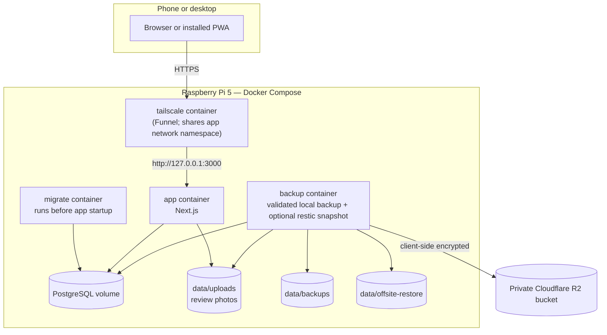

# Architecture

## Product shape

Personal Control Center is a phone-first responsive web application packaged as an installable Progressive Web App (PWA).

Desktop remains supported, but the primary interaction assumptions are:

- short, frequent capture sessions from a phone;
- one-handed navigation where practical;
- large touch targets and readable layouts without zooming;
- fast startup and minimal required input;
- longer review sessions that also work comfortably on a larger screen.

A separate native application should only be introduced if an important workflow cannot be delivered reliably through the PWA.

## Current stack

The deployed stack is:

- Next.js with TypeScript and React, built as a standalone server image;
- PostgreSQL through the `postgres` client;
- Tailwind CSS;
- Docker Compose on a Raspberry Pi 5 (`linux/arm64`), with the same stack validated on `linux/amd64` in CI;
- Tailscale Funnel for public HTTPS without a purchased domain or router port forwarding;
- Node's built-in test runner for domain tests and production-stack integration checks;
- validated local PostgreSQL and upload backups;
- client-side encrypted and deduplicated `restic` snapshots in a private Cloudflare R2 bucket.

PostgreSQL has been the canonical data store since Slice 3. Browser `localStorage` remains available for the original browser-data migration, the explicit browser-only development mode, and temporary fallback if server persistence fails. It is not an offline synchronisation system.

## System topology

The host publishes the app only on `127.0.0.1:3000`. PostgreSQL is not published outside the Compose network. The Tailscale container uses the app container's network namespace and is the only public ingress path.

See:

- `docs/phone-deployment.md` for Funnel and production deployment;
- `docs/authentication.md` for users, sessions, and invitations;
- `docs/review-photo-storage.md` for durable review photos;
- `docs/offsite-backups.md` for R2 and `restic` recovery.

## Persistence and synchronisation

Each authenticated account owns one row in `personal_data_state`. That row contains:

- an incrementing revision;
- a versioned `jsonb` snapshot;
- items of every kind, including projects, tasks, thoughts, and notes;
- the active Weekly Review draft;
- completed review history.

Mutations are scoped by authenticated user ID and run in a transaction. The server locks the user's state row with `SELECT ... FOR UPDATE`, applies one validated domain mutation, increments the revision, and returns the updated snapshot.

The client applies mutations optimistically so discrete actions feel immediate. Continuously edited Inbox and Weekly Review text is kept local while typing and persisted after roughly 800 ms of inactivity or immediately on blur/submit. This prevents one database write per character and prevents older responses from replacing newer text.

A browser periodically checks for a newer server revision when no local mutation is pending. The current model is designed for a very small number of independent users and low write contention, not collaborative simultaneous editing.

## Navigation architecture

Navigation is driven by `src/lib/navigation.ts` rather than page-specific hard-coded menus.

### Compact screens

- one permanent central Capture action;
- four configurable pinned destinations;
- a floating bottom dock;
- an All Spaces directory for all current and future modules.

The default pins are Inbox, Projects, Tasks, and Review. Thoughts is also pinnable. Pin configuration is stored per browser/device, so a phone may use a different quick-access layout from another browser.

Accomplishments, Archive, account access, and future modules remain available through All Spaces without crowding the dock.

### Wider screens

The desktop rail shows all available primary destinations rather than being limited to the four mobile pins. Capture and All Spaces remain permanent navigation paths.

### Future modules

Library, Trips, Fitness, Habits, and later modules register in the shared navigation configuration. A module can appear in All Spaces before becoming a primary or pinnable destination.

## PWA and notification strategy

The PWA evolves incrementally:

1. web-app manifest and mobile metadata — delivered;
2. home-screen installation with standard, maskable, and Apple icons — delivered;
3. authenticated multi-device persistence — delivered;
4. narrow Weekly Review notification experiment — delivered, pending live observation;
5. offline-friendly capture and background synchronisation — not started;
6. broader push notifications — later work only if the narrow experiment proves valuable.

Slice 4 provides a deterministic in-app reminder for an unfinished Weekly Review from Sunday through Friday after 08:00 local time. It also attempts a browser/PWA notification when permission and platform execution allow it. Background delivery while the app is fully closed is not guaranteed; issue #21 tracks real-device observation. The in-app reminder remains available whenever the application is opened.

The application must remain usable in a normal browser. Installation improves convenience but does not create a separate product path.

## Domain model

Domain logic in `src/domain/` is plain TypeScript and is independent of React and PostgreSQL.

### Item

`Item` provides the shared lifecycle for captured records:

- identity, title, description, kind, area, status, and timestamps;
- prior status metadata for correct reopen and archive restoration;
- an optional task check-in date;
- a project-action timeline for projects;
- completion metadata used by Weekly Review and history.

Status transitions, completion, archival, task-date rules, review periods, and snapshot normalisation are implemented in domain functions rather than duplicated across pages.

### Project actions

Projects preserve a sequence of action points. One action may be current; completed actions retain dates and free-form completion notes. Completing an action can open the next action, move the project to Waiting, or complete the project.

### Standalone tasks

Tasks represent one-off actions that do not need a project timeline. They have a title, optional notes, area, and optional check-in date. Undated tasks remain open without age-based warnings. Completed tasks leave the active Tasks view while retaining the metadata required for Weekly Review, export, and backup.

### Weekly Review

One review period opens each Saturday for the immediately preceding Saturday-to-Friday period. A draft remains tied to that period through Friday, completion locks that period, and a new Saturday replaces an unfinished older draft.

The generated context includes:

- projects needing a current action, date, or check-in response;
- project actions opened and completed during the period;
- projects completed during the period;
- open tasks;
- tasks completed during the period;
- thoughts added during the period.

## Relational schema

PostgreSQL stores authentication and personal state in a small schema:

- `users` — identity, role, status, password hash, and timestamps;
- `personal_data_state` — one revisioned snapshot per user;
- `personal_data_imports` — idempotency records for browser-data imports;
- `auth_sessions` and `user_invites` — hashed tokens and expiry metadata;
- `schema_migrations` — applied migration versions.

The snapshot model was chosen over a fully normalised item schema to keep lifecycle changes atomic and the first private deployment simple. A more normalised reporting model can be introduced later if querying needs justify it.

## Security boundaries

Implemented controls include:

- secrets in ignored deployment files and read-only secret mounts, never browser code;
- application-layer user isolation on every personal-data query and filesystem operation;
- `scrypt` password hashing and timing-safe comparison;
- SHA-256 storage of session and invitation tokens rather than raw tokens;
- global and per-account login throttling with fixed dummy password work;
- HTTP-only, `SameSite=Lax` sessions and Secure cookies in production;
- user-scoped review-photo paths, server-generated UUID references, size limits, and file-signature validation;
- PostgreSQL and app endpoints kept off public interfaces;
- client-side encryption before backup data reaches R2;
- validated local and off-site restore preparation before destructive application.

The current user-isolation model is appropriate for one trusted application process. A future multi-process or collaborative deployment would require revisiting shared rate-limit state, concurrency, and authorisation design.

## Architecture decision records

Use short records for choices that would be expensive or confusing to revisit. Each record should include context, decision, consequences, and status.
