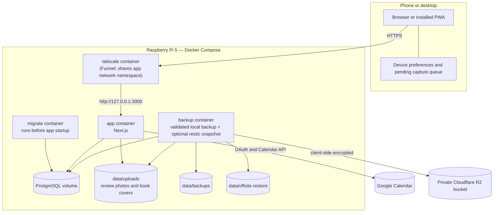

# Architecture

## Product shape

Personal Control Center is a phone-first responsive web application packaged as an installable Progressive Web App (PWA).

Desktop remains supported, but the primary interaction assumptions are:

- short, frequent capture sessions from a phone;
- one-handed navigation where practical;
- large touch targets and readable layouts without zooming;
- fast startup and minimal required input;
- longer review, editing, planning, and reconciliation sessions that also work comfortably on a larger screen.

A separate native application should only be introduced if an important workflow cannot be delivered reliably through the PWA.

## Current stack

The deployed stack is:

- Next.js with TypeScript and React, built as a standalone server image;
- PostgreSQL through the `postgres` client;
- Tailwind CSS and shared CSS-variable theme tokens;
- Docker Compose on a Raspberry Pi 5 (`linux/arm64`), with the same stack validated on `linux/amd64` in CI;
- Tailscale Funnel for public HTTPS without a purchased domain or router port forwarding;
- Node's built-in test runner for domain tests and production-stack integration checks;
- validated local PostgreSQL and upload backups;
- client-side encrypted and deduplicated `restic` snapshots in a private Cloudflare R2 bucket.

PostgreSQL has been the canonical personal-data store since Slice 3. Browser storage remains intentionally limited to:

- explicit migration of the original prototype data;
- browser-only development mode;
- temporary fallback protection if server persistence fails;
- the per-device offline Quick Capture queue;
- device-specific theme and mobile quick-access preferences.

It is not a general offline synchronisation or collaborative editing system. Personal Expenses uses the canonical server snapshot and is online-only in V1 rather than extending the Quick Capture queue implicitly.

## System topology



The host publishes the app only on `127.0.0.1:3000`. PostgreSQL is not published outside the Compose network. The Tailscale container uses the app container's network namespace and is the only intended public ingress path.

See:

- `docs/phone-deployment.md` for Funnel and production deployment;
- `docs/authentication.md` for users, sessions, and invitations;
- `docs/review-photo-storage.md` for durable private uploads;
- `docs/offsite-backups.md` for R2 and `restic` recovery;
- `docs/google-calendar.md` for the optional one-way Calendar projection;
- `docs/offline-capture.md` for the narrow offline boundary;
- `docs/expenses.md` for the Personal Expenses data and reconciliation boundary.

## Persistence and synchronisation

Each authenticated account owns one row in `personal_data_state`. That row contains:

- an incrementing revision;
- a versioned `jsonb` snapshot;
- items of every supported kind, including projects, tasks, thoughts, notes, and books;
- project action history, note ordering, and Library ordering/classification payloads;
- Personal Expenses transactions, allocation settings, and the reconciliation boundary;
- the active Weekly Review draft;
- completed review history.

Mutations are scoped by authenticated user ID and run in a transaction. The server locks the user's state row with `SELECT ... FOR UPDATE`, applies one validated domain mutation, increments the revision, and returns the updated snapshot.

The client applies discrete mutations optimistically so actions feel immediate. Continuously edited Inbox and Weekly Review text is kept local while typing and persisted after roughly 800 ms of inactivity or immediately on blur/submit. This prevents one database write per character and prevents older responses from replacing newer text.

Expense mutations use the same server mutation boundary and row locking. The Expenses page has a focused client hook that normalises the complete returned snapshot, queues its writes serially, shows save/error state, and refreshes canonical state after a failed optimistic save. This does not create a second persistence store.

A browser periodically checks for a newer server revision when no local mutation is pending. The current model is designed for a very small number of independent users and low write contention, not collaborative simultaneous editing.

## Device-local state

Two preferences intentionally remain per browser/device rather than in PostgreSQL:

- the four mobile quick-access destinations;
- the selected visual theme.

Both use versioned `localStorage` keys, validate stored values, and fall back safely when a value is missing or malformed. This allows a phone and desktop browser for the same account to use different navigation and appearance.

Pending offline captures are also device-local until the server confirms them. They use stable client-generated item IDs so ambiguous retries do not create duplicates.

Expense transactions and reconciliation state are not device-local. A failed or offline expense write is not advertised as durable until the server confirms it.

## Navigation architecture

Navigation is driven by `src/lib/navigation.ts` rather than page-specific hard-coded menus.

### Compact screens

- one permanent central Capture action;
- four configurable pinned destinations;
- a floating bottom dock;
- a tappable upward handle beneath Capture that opens All Spaces;
- an All Spaces directory for every available working module, account access, mobile-pin configuration, and future destinations.

The default pins are Inbox, Projects, Tasks, and Review. Thoughts, Notes, Library, and Expenses are also pinnable. Pin configuration is stored per browser/device.

Accomplishments and Archive remain available through All Spaces without crowding the dock.

### Wider screens

The desktop rail shows all available pinnable destinations rather than being limited to the four mobile pins. Capture and All Spaces remain permanent navigation paths.

### Future modules

Trips, Fitness, Habits/Routines, Events/Appointments, and later modules register in the shared navigation configuration. A module can appear as a disabled future destination before implementation, then become available and optionally pinnable without redesigning the shell.

## Interface and theme architecture

The neutral interface uses shared layout, spacing, card, control, icon, and heading conventions defined in `docs/interface-rules.md`.

A theme is applied at the document root through `data-theme` and shared CSS variables. The saved preference is applied before first paint to avoid a flash of the Default palette. Themes may change:

- page and surface colours;
- foreground and muted colour scales;
- primary actions;
- borders and restrained line treatment;
- the centre Capture artwork on phone and desktop;
- the browser theme colour.

They do not change routes, information hierarchy, touch targets, or workflows. Danger, Waiting, success, disabled, and focus meaning remains understandable across themes.

The current game artwork is packaged as one small sprite, with the Pokémon symbol rendered as a crisp vector. Advanced art-direction effects remain later optional work.

## PWA, offline, and notification strategy

Delivered layers are:

1. web-app manifest and mobile metadata;
2. home-screen installation with standard, maskable, and Apple icons;
3. authenticated multi-device persistence;
4. deterministic Weekly Review in-app reminders plus a best-effort browser/PWA notification path;
5. a root-scope service worker with a pre-cached Capture-only fallback and durable duplicate-safe pending queue.

The service worker does not cache authenticated application HTML or personal API responses. A prepared installed PWA uses normal network-first navigation and serves the dedicated offline Capture page only when navigation cannot reach the server.

Weekly Review background delivery while the app is fully closed is not guaranteed; issue #21 tracks real-device observation. The in-app reminder remains available whenever the application is opened.

Broader push notifications and full offline editing remain later work only if a concrete workflow justifies their complexity. Personal Expenses does not widen the offline promise in V1.

## Domain model

Domain logic in `src/domain/` is plain TypeScript and is independent of React and PostgreSQL.

### Item

`Item` provides the shared lifecycle for captured records:

- identity, title, description, kind, area, status, and timestamps;
- prior status metadata for correct reopen and archive restoration;
- an optional task check-in date;
- a project-action timeline for projects;
- completion metadata used by Weekly Review and history.

Status transitions, completion, archival, task-date rules, review periods, and snapshot normalisation are implemented in domain functions rather than duplicated across pages.

### Project actions

Projects preserve a sequence of action points and may contain several independently open actions. Each action may be dated or undated. Completed and rescheduled actions retain dates, notes, and history.

A project with no open actions becomes Waiting. Adding an action reactivates it. Project completion is a separate explicit action with required takeaways; completing one action never completes the project implicitly.

### Standalone tasks

Tasks represent one-off actions that do not need a project timeline. They have a title, optional notes, area, and optional check-in date. Undated tasks remain open without age-based warnings. Completed tasks leave the active Tasks view while retaining metadata required for Weekly Review, export, and backup.

### Thoughts and Notes

Thoughts are retained observations that remain read-only by default and do not use normal deletion or completion workflows.

Notes are editable plain-text reference records. Their first line is the implicit title, cards use persistent manual ordering, and Notes remain distinct from Thoughts throughout Inbox organisation, views, import, export, backup, and restore.

### Book Library

A book reuses the existing item snapshot with a versioned Library payload. Reading state, ownership, and priority remain independent so generated views can be derived without duplicating records. Optional dates, ratings, thoughts/takeaways, and Up next ordering are preserved in the same canonical snapshot.

Original cover uploads are private user-scoped files. The authenticated cover endpoint generates a bounded WebP display response on request, uses private browser caching and ETag revalidation, and falls back to the original bytes if optimisation fails. Backups preserve the original upload tree, not a second derivative store.

### Personal Expenses

Expense state extends the same personal-data snapshot with three values:

- `expenseTransactions` — user-scoped expense and income records;
- `expenseSettings` — EUR plus high-level allocation percentages;
- `expenseReconciliation` — the last manually checked-through date.

Amounts are stored as positive integer cents. Type/category combinations and calendar dates are validated in the domain layer. Expense categories map to Essentials, Fun, or Future You; income categories remain separate. Monthly summaries are derived from canonical transactions rather than stored as copied monthly records.

Older snapshots normalise to empty expense history, 50/30/20 targets, and no reconciliation marker, so the feature does not require a PostgreSQL schema migration. Import/export and database/off-site backups automatically include the new snapshot fields.

Weekly reconciliation remains deliberately manual. PCC stores only its own transactions and a boundary marker; it does not store a bank connection or assert statement completeness. Once the boundary date is in the past, the next check includes that date again so transactions made later on the day of the previous check cannot be skipped permanently.

### Weekly Review

One review period opens each Saturday for the immediately preceding Saturday-to-Friday period. A draft remains tied to that period through Friday, completion locks that period, and a new Saturday replaces an unfinished older draft.

Generated context includes:

- projects needing an action or dated-action response;
- project actions opened and completed during the period;
- projects completed during the period;
- open tasks;
- tasks completed during the period;
- thoughts added during the period;
- books started or finished during the period when dates exist.

## Google Calendar projection

The optional Calendar integration stores one encrypted refresh-token connection per application user plus durable source-to-event mappings.

The projection includes:

- dated open Tasks;
- every dated open project action whose project is active and not archived or completed.

Each becomes an all-day event in a separate application-created calendar. Relevant item/project mutations trigger reconciliation; review-only and expense-only mutations do not. Calendar failure is recorded but never rolls back a successful canonical Personal Control Center mutation.

The integration is one-way. Direct Google-side edits are not imported, and the app does not write to the user's primary calendar.

## Relational schema

PostgreSQL stores authentication, personal state, and integration metadata in a small schema:

- `users` — identity, role, status, password hash, and timestamps;
- `personal_data_state` — one revisioned snapshot per user, including Personal Expenses state;
- `personal_data_imports` — idempotency records for browser-data imports;
- `auth_sessions` and `user_invites` — hashed tokens and expiry metadata;
- Google Calendar connection and event-mapping tables — encrypted credentials, secondary-calendar identity, source/event IDs, sync hashes, and errors;
- `schema_migrations` — applied migration versions.

The snapshot model was chosen over a fully normalised item schema to keep lifecycle changes atomic and the private deployment simple. More normalised reporting tables can be introduced later if querying needs justify them. The current expense workload is small enough that monthly and category summaries are derived directly from the snapshot.

## Private file storage

`UPLOAD_ROOT` is mounted from `./data/uploads` and stores user-scoped files outside the application container:

```text
<user-id>/review-photos/<photo-id>
<user-id>/book-covers/<cover-id>
```

The server generates opaque IDs, validates file signatures and size limits, resolves paths inside the authenticated user's directory, and never exposes arbitrary filesystem paths.

The backup service creates a paired upload archive with every database dump, and restic snapshots include the raw upload tree for deduplication.

## Security boundaries

Implemented controls include:

- secrets in ignored deployment files and read-only secret mounts, never browser code;
- application-layer user isolation on every personal-data, integration, and filesystem operation;
- `scrypt` password hashing and timing-safe comparison;
- SHA-256 storage of session and invitation tokens rather than raw tokens;
- global and per-account login throttling with fixed dummy password work;
- HTTP-only, `SameSite=Lax` sessions and Secure cookies in production;
- user-scoped upload paths, server-generated UUID references, size limits, and file-signature validation;
- AES-256-GCM encryption of Google refresh tokens at rest;
- PostgreSQL and app endpoints kept off public interfaces;
- client-side encryption before backup data reaches R2;
- validated local and off-site restore preparation before destructive application.

Personal Expenses inherits the same authenticated user scope and backup boundary as the rest of the snapshot. V1 introduces no bank credential, account number, Open Banking token, or additional secret-storage path.

The current user-isolation and rate-limit model is appropriate for one trusted application process. A future multi-process or collaborative deployment would require revisiting shared rate-limit state, concurrency, and authorisation design.

## Architecture decision records

Use short records for choices that would be expensive or confusing to revisit. Each record should include context, decision, consequences, and status.
