# Product Roadmap

This roadmap tracks delivered slices and the current product direction. Sequence matters more than fixed dates, and a structurally obvious feature should not outrank a workflow that is actually useful.

## Progress at a glance

```mermaid
graph LR
    S1["Slice 1<br/>Phone-first foundation<br/>✅ PR #7"]
    S2["Slice 2<br/>Actionable projects<br/>✅ PR #10"]
    S3["Slice 3<br/>Durable deployment<br/>✅ PR #13"]
    HARDEN["Hardening<br/>auth, uploads, R2<br/>✅ PR #14, #18"]
    S4["Slice 4<br/>Tasks and Weekly Review<br/>✅ PR #20, #22"]
    S5["Slice 5<br/>Google Calendar<br/>✅ PR #25"]
    S6["Slice 6<br/>Offline capture<br/>✅ PR #27"]
    EXT["Workflow extensions<br/>projects and Notes<br/>✅ PR #29, #30"]
    S7["Slice 7<br/>Book Library<br/>✅ PR #32"]
    S8["Slice 8<br/>UI and themes<br/>✅ PR #34, #35, #36"]
    S9["Slice 9<br/>Personal Expenses<br/>🚧 in progress"]

    S1 --> S2 --> S3 --> HARDEN --> S4 --> S5 --> S6 --> EXT --> S7 --> S8 --> S9

    classDef done fill:#ecfdf5,stroke:#10b981,color:#065f46;
    classDef pending fill:#f8fafc,stroke:#94a3b8,color:#334155;
    class S1,S2,S3,HARDEN,S4,S5,S6,EXT,S7,S8 done;
    class S9 pending;
```

## Slice 1 — Phone-first foundation

**Status: complete in PR #7.**

Delivered the initial Next.js application shell, Capture, Inbox, Projects, Thoughts, Review, All Spaces, browser-local prototype persistence, basic completion, initial PWA metadata, and Docker-ready runtime.

## Slice 2 — Make projects actionable

**Status: complete in PR #10.**

Delivered shared domain actions, dated project actions with history, compact cards and full detail views, completion notes, Waiting, overdue attention, Accomplishments, recoverable Archive, and focused lifecycle tests.

## Slice 3 — Durable personal deployment

**Status: complete in PR #13; production runs on Raspberry Pi.**

Delivered PostgreSQL canonical state, explicit browser-data migration, invite-only isolated accounts, sessions and revocation, user-scoped reads/mutations/import/export, Tailscale Funnel HTTPS, installable PWA assets, validated local backups, safe deployment/restore scripts, ARM64 production, and AMD64 CI validation.

### Deployment hardening

PR #14 added login throttling, account-enumeration timing protection, durable private review photos, paired database/upload backup and restore, production security checks, and zero-warning lint.

PR #18 added client-side encrypted Cloudflare R2/restic snapshots, retention/pruning, visible backup health, staged restore preparation, and a successful isolated restore rehearsal.

Current optional infrastructure backlog:

- repeat disaster recovery on a genuinely separate clean host periodically;
- add a second local copy on USB storage or a future NAS;
- evaluate published immutable multi-architecture images only if host build time or rollback needs justify the added release infrastructure.

## Slice 4 — Standalone Tasks and scheduled Weekly Review

**Status: complete in PR #20, with continuous-text persistence corrected in PR #22.**

Delivered dated or undated Tasks, fixed Saturday-to-Friday Review periods, generated project/task/thought context, review history, in-app reminders, best-effort browser notifications, configurable mobile quick access, and debounced long-form persistence.

PR #42 later added expandable full Review-history reading plus optimized private photo delivery with browser caching and ETag revalidation.

Real background notification behaviour remains a non-blocking observation in issue #21.

## Slice 5 — Google Calendar bridge

**Status: complete and live-tested in PR #25.**

Delivered per-user OAuth, encrypted refresh-token storage, a separate application-created calendar, one-way all-day projection, durable event mappings, duplicate-safe reconciliation, visible sync/error state, manual recovery, and clean disconnect/reconnect behaviour.

PR #29 later expanded the projection from one current project action to every dated open project action.

Two-way synchronisation remains optional future evaluation in issue #26.

## Slice 6 — Offline Quick Capture

**Status: complete and phone-tested in PR #27.**

Delivered a root-scope service worker, dedicated pre-cached Capture-only cold-start fallback, durable per-user device queues, stable client-generated IDs, duplicate-safe retry, online/offline/pending/error states, automatic recovery, and production-image checks proving the offline assets are deployed.

The boundary remains narrow: other spaces and authenticated editing remain online-only.

## Post-Slice-6 workflow extensions

### Multiple open project actions

**Status: complete in PR #29.**

Delivered parallel/sequential actions, optional dates and first actions, reschedule notes/history, automatic Active/Waiting transitions, explicit project completion with takeaways, and correct Home, Review, Calendar, import/export, backup, and restore behaviour.

### Editable Notes

**Status: complete in PR #30.**

Delivered direct and Inbox-to-Note creation, implicit first-line titles, compact two-column cards, full-screen editing, persistent phone-safe drag ordering, permanent deletion, and strict separation from Thoughts.

PR #42 later removed the lossy Cancel flow, added debounced autosave and safe Markdown formatting/preview, and kept existing plain-text storage compatible.

## Slice 7 — Book Library

**Status: complete in PR #32.**

Delivered an available and pinnable Library; direct and Inbox-to-Book creation; independent reading state, ownership, and priority; generated views; title/author search and expandable filters; persistent Up next ordering; optional metadata, dates, ratings, overall override, and Thoughts and takeaways; private user-scoped covers; dated reading activity in Weekly Review; and import/export/backup/restore compatibility.

PR #35 later added bounded WebP display responses, private caching, and ETag revalidation while preserving original uploads.

Future Library enhancement issue #33 tracks photo-assisted title/author recognition after enough real use exists to judge the value.

## Slice 8 — Interface simplification and game themes

**Status: complete in PRs #34, #35, and #36.**

PR #34 documented the structural rules.

PR #35 delivered removal of the overlapping mobile Spaces button and wasted top area, a tappable dock-attached Spaces handle, compact directory rows, title-focused headers, consistent top spacing and icon treatment, silent normal online state, session-stable Home greetings, and the Library cover-delivery performance fix.

PR #36 delivered Default plus Pokémon, Hades, Hades II, Hollow Knight, Silksong, Elden Ring, Cyberpunk 2077, The Witcher 3, and Stardew Valley themes; per-browser/device persistence before first paint; shared palette/surface/accent/line tokens; theme-specific centre Capture artwork on phone and desktop; an optimised artwork sprite plus vector Poké Ball; and preservation of layout, workflows, touch targets, and semantic status meaning.

PR #42 later centralized semantic foreground and divider rules so overdue, Waiting, success, and error cards remain readable across themes.

This UI slice is complete. Future visual work should be selected independently rather than treated as unfinished acceptance criteria.

## Slice 9 — Personal Expenses

**Status: selected and implementation in progress on `agent/personal-expenses`.**

The feature is based on the useful behavior of the earlier spreadsheet budget workflow rather than a literal spreadsheet recreation. The primary goal is to make manual logging easy enough to happen immediately after spending while preserving a weekly recovery path for transactions that were missed.

Accepted V1 boundary:

- an available and pinnable Expenses space with Quick Add always visible;
- expense and income records using amount, category, date, and optional description;
- date defaults to today and repeated entry keeps useful context instead of resetting every field;
- detailed categories map automatically to Essentials, Fun, or Future You;
- configurable high-level allocation targets, defaulting to 50/30/20 and required to total 100%;
- a monthly view with income, ordinary spending, Future You allocation, remaining money, bucket target/actual progress, category totals, and editable transactions;
- Future You remains part of allocation mathematics but is visually separate from consumption spending;
- a Weekly check view that compares PCC's chronological entries against the user's bank history and stores a durable checked-through date;
- manual add/edit/delete during reconciliation rather than automated transaction matching;
- user-scoped snapshot persistence, normal import/export/backup compatibility, and no unnecessary Calendar reconciliation;
- EUR and online-only entry for V1.

The detailed behavior and current non-goals are recorded in [`expenses.md`](expenses.md).

Before this slice can be marked complete it still requires normal CI/build/production-stack validation and real phone testing of both immediate entry and the weekly-check flow.

## Current selection

**Personal Expenses is the selected major product slice.**

Other ideas remain candidates rather than an ordered queue.

### Encrypted Password Keychain

**Feasibility decision: accepted future candidate; implementation not yet selected.**

The accepted boundary is a client-encrypted personal secrets vault, not plaintext records in the normal personal-data snapshot and not a claim to replace a mature audited password manager. The complete threat model and staged design are recorded in [`password-keychain.md`](password-keychain.md).

Candidate behaviour and constraints:

- separate Keychain master password plus a separately stored recovery key;
- random per-user vault key wrapped client-side with an Argon2id-derived key;
- independently authenticated-encrypted records with all labels, usernames, URLs, notes, and secrets hidden from the server;
- dedicated user-scoped tables and endpoints, excluded from Inbox, Notes, Review, Calendar, normal import/export, logs, and service-worker caching;
- masked values, deliberate reveal/copy, automatic re-hiding, memory-only unlock state, and fixed inactivity/background locking;
- backups contain ciphertext only and restore without requiring the server to know the master password;
- explicit limitation that a compromised browser/device or malicious server code delivered at unlock can still capture decrypted data;
- three security-focused implementation stages: encrypted foundation, locked phone-first UI, then hardening and independent review before important production use.

Issue #41 tracks the design decision. Implementation should receive new stage-specific issues rather than expanding that evaluation issue into one large feature PR.

### Today/Home horizon

A focused near-term view reached through a Home button rather than listed as a normal All Spaces module.

Candidate behaviour:

- Today, Tomorrow, and two-days-ahead filters;
- dated open Tasks and dated open project actions;
- no invented dates merely to make uncertain work appear;
- undated projects/actions/tasks remain valid and continue to surface through their normal spaces and Weekly Review.

### Routines/Habits

Recurring responsibilities and practices, only after recurrence, completion, pause, and review rules are concrete enough to avoid building a generic streak tracker.

### Events/Appointments

Time-specific commitments with start/end time, location, attendance, and preparation context. This may become the strongest reason to revisit inbound Calendar synchronisation.

### Trips

Ideas, dates, budgets, options, decision deadlines, and supported monitoring.

### Fitness

Imported activity and trend summaries without turning the app into a manual workout logger.

### Library follow-ups

Photo-assisted identification is tracked in issue #33. Metadata lookup, progress, highlights, recommendations, or other media should wait for a specific observed need.

### Notification observation

Issue #21 remains open for real installed-PWA behaviour when foregrounded, backgrounded, fully closed, battery-optimised, or restarted.

### Optional two-way Calendar

Issue #26 remains deliberately unselected until supported record types, inbound fields, conflict rules, delivery mechanism, and failure behaviour are explicit.

### Advanced art-direction themes

A later theme may add restrained texture, painterly borders, or decorative layers—for example a Clair Obscur: Expedition 33-inspired brush treatment—without changing layout, control meaning, or semantic states.

## Product rules that continue to constrain future work

- Phone usability comes before desktop decoration.
- Personal Control Center remains useful without integrations, notifications, or AI.
- External services do not silently become canonical.
- Offline claims remain narrower than the actual supported workflow.
- New modules should enter through All Spaces and shared navigation configuration.
- Themes may add personality but not engagement pressure or ambiguous semantic states.
- Features should be selected from observed friction or value, not simply because they are common in planning apps.