# Product Roadmap

This roadmap tracks delivered slices and the current product direction. Sequence matters more than fixed dates, and a structurally obvious feature should not outrank a workflow that is actually useful to the user.

## Progress at a glance

```mermaid
graph LR
    S1["Slice 1<br/>Phone-first foundation<br/>✅ PR #7"]
    S2["Slice 2<br/>Actionable projects<br/>✅ PR #10"]
    S3["Slice 3<br/>Durable deployment<br/>✅ PR #13"]
    HARDEN["Deployment hardening<br/>auth, photos, R2<br/>✅ PR #14, #18"]
    S4["Slice 4<br/>Tasks and Weekly Review<br/>✅ PR #20, #22"]
    S5["Slice 5<br/>Google Calendar bridge<br/>✅ PR #25"]
    S6["Slice 6<br/>Offline capture<br/>✅ PR #27"]
    EXT["Workflow extensions<br/>multi-action projects and Notes<br/>✅ PR #29, #30"]
    S7["Slice 7<br/>Book Library<br/>Selected next"]
    S8["Slice 8<br/>Themes and interface personality<br/>Planned"]
    POOL["Later product modules<br/>Unselected"]

    S1 --> S2 --> S3 --> HARDEN --> S4 --> S5 --> S6 --> EXT --> S7 --> S8 --> POOL

    classDef done fill:#ecfdf5,stroke:#10b981,color:#065f46;
    classDef selected fill:#eff6ff,stroke:#3b82f6,color:#1e3a8a;
    classDef planned fill:#fff7ed,stroke:#f97316,color:#9a3412;
    classDef pending fill:#f8fafc,stroke:#94a3b8,color:#334155;
    class S1,S2,S3,HARDEN,S4,S5,S6,EXT done;
    class S7 selected;
    class S8 planned;
    class POOL pending;
```

## Slice 1 — Phone-first foundation and feedback loop

**Status: complete and merged in PR #7.**

Delivered:

- mobile-first Next.js application shell;
- quiet Capture landing page;
- Inbox, Projects, Thoughts, Review, and All Spaces routes;
- floating mobile dock and desktop rail;
- quick capture with browser-local persistence;
- basic completion states;
- Weekly Review with open work, completed items, and recent thoughts;
- guided reflection fields, location, and photo metadata;
- initial PWA manifest;
- Docker-ready runtime.

## Slice 2 — Make projects actionable

**Status: complete and merged in PR #10.**

Delivered:

- shared application data provider and domain layer;
- safe migration and debounced browser-local writes;
- dated project action points with preserved history;
- compact active-project cards showing the current action and date;
- full-screen project details and expandable timelines;
- free-form completion notes followed by a next action, Waiting, or project completion;
- overdue attention states on Capture, project cards, and timelines;
- yellow Waiting treatment without global warnings;
- Accomplishments and recoverable Archive spaces;
- Weekly Review context for project attention, opened and completed actions, completed projects, and recent thoughts;
- focused automated tests for lifecycle and date behavior.

## Slice 3 — Durable personal deployment

**Status: complete in PR #13. Production runs on Raspberry Pi.**

Delivered:

- PostgreSQL as the canonical personal-data store;
- safe browser-to-server backup and import;
- invite-only authentication for a small number of fully isolated accounts;
- HTTP-only database-backed sessions and immediate account revocation;
- per-user reads, mutations, imports, exports, photos, and browser fallback data;
- Tailscale Funnel HTTPS without a purchased domain or router port forwarding;
- Secure-cookie production configuration and a stable `*.ts.net` address;
- installable PWA icons for Android, maskable, and Apple use;
- validated local PostgreSQL dumps and paired upload archives;
- safe deployment and restoration scripts;
- exact Compose CI validation of migrations, authentication, synchronisation, cross-user isolation, PWA assets, photos, and backup readability;
- successful ARM64 deployment, reboot recovery, and retirement of the temporary DigitalOcean host.

### Post-Slice-3 hardening

PR #14 delivered:

- bounded login throttling and per-account cooldowns;
- fixed dummy password work to reduce account-enumeration timing differences;
- private user-scoped review-photo persistence;
- authenticated photo retrieval, replacement, removal, and cross-user isolation;
- paired database and upload backup/restore support;
- repeatable production security checks and zero-warning lint.

PR #18 delivered:

- client-side encrypted and deduplicated `restic` snapshots in a private Cloudflare R2 bucket;
- fresh validated database and upload backups before each off-site snapshot;
- 7 daily, 4 weekly, and 6 monthly retention with controlled pruning;
- visible backup success, age, size, and health status;
- staged off-site restore preparation that validates data before applying it;
- a successful isolated restore rehearsal without overwriting production.

Optional deployment hardening remains available but does not block product work:

- publish immutable AMD64 and ARM64 images from CI instead of building on the production host;
- automate rollback to a previously published image;
- repeat disaster recovery on a genuinely separate clean host;
- add an optional second local copy on USB storage or a future NAS.

See `docs/slice-3-plan.md`, `docs/authentication.md`, `docs/phone-deployment.md`, `docs/review-photo-storage.md`, `docs/security-hardening.md`, and `docs/offsite-backups.md`.

## Slice 4 — Standalone tasks and scheduled Weekly Review

**Status: complete in PR #20, with continuous-text persistence fixed in PR #22.**

Delivered:

- standalone dated or undated Tasks;
- one fixed Saturday-to-Friday Weekly Review period;
- generated project, task, completion, and thought context;
- review history and in-app reminders;
- best-effort browser/PWA notification delivery;
- four configurable mobile quick-access destinations;
- debounced continuous-text persistence with immediate blur/action flushes.

Real background notification behavior remains an observation task in issue #21 and does not block product work.

## Slice 5 — Google Calendar bridge

**Status: complete, live-tested, and merged in PR #25.**

Delivered:

- per-user Google OAuth with encrypted refresh-token storage;
- a separate Personal Control Center Google Calendar;
- one-way projection of dated Tasks and open project actions;
- all-day event creation, updates, rescheduling, completion, archive, deletion, and action transitions;
- duplicate-safe event mappings and manual reconciliation;
- visible connection, event-count, last-sync, and failure state;
- clean disconnect/reconnect behavior;
- production OAuth configuration without the seven-day Testing token limit.

Two-way synchronisation remains intentionally out of scope and is tracked as an optional future evaluation in issue #26.

## Slice 6 — Offline capture

**Status: complete, phone-tested, and merged in PR #27.**

The implementation remains focused on Quick Capture rather than making the complete application offline-capable.

Delivered:

- a dedicated pre-cached Capture-only fallback for cold starts without connectivity;
- a durable per-user browser queue for pending captures;
- offline creation of new Inbox captures with stable client-generated IDs;
- visible online, offline, pending, syncing, retry, and last-error states;
- automatic retry after reconnection, focus, visibility changes, periodic checks, and recovery from the standalone offline screen;
- duplicate-safe recovery when a request succeeds on the server but its response is lost;
- a unified root-scope service worker for offline capture and Weekly Review notification clicks;
- production-image checks proving the service worker and offline assets are physically deployed and publicly retrievable;
- focused queue, offline-shell, delivery, persistence, authentication, backup, and restore validation.

Explicit boundaries:

- queued captures are device-local until PostgreSQL confirms them;
- API responses and authenticated application pages are never stored in the service-worker cache;
- Inbox organisation and edits to Projects, Tasks, Thoughts, Notes, Reviews, photos, Account settings, and Calendar settings remain online-only;
- clearing browser site data or uninstalling the PWA can remove unsynchronised device-local captures.

## Post-Slice-6 workflow extensions

### Multiple open project actions

**Status: complete and merged in PR #29.**

Delivered:

- multiple parallel or sequential open actions per project;
- optional action dates and optional first actions;
- rescheduling the same action without creating a false completion;
- lightweight date-change notes and history;
- automatic Active and Waiting transitions based on whether open actions exist;
- separate project completion with required takeaways;
- correct Home, Weekly Review, Calendar, archive, import, export, backup, and restore behavior across all actions.

### Editable Notes space

**Status: complete and merged in PR #30.**

Delivered:

- direct Note creation and Inbox-to-Note organisation;
- first-line implicit titles with no dedicated title field;
- compact title-only cards in a responsive two-column layout;
- full-screen plain-text editing;
- persistent manual ordering with a phone-safe long-press drag grip;
- permanent deletion with confirmation;
- strict separation between mutable Notes and immutable Thoughts;
- persistence through user snapshots, imports, exports, backups, and restores.

## Slice 7 — Book Library

**Status: selected as the next product slice.**

### Product intent

The first Library version is a personal reading system, not a generic media database. It should make it easy to see:

- what is currently being read;
- what should be read next;
- which owned books remain unread;
- which books are wanted but not yet owned;
- what has already been finished;
- what the user thought and retained from each book.

A Library is prioritised ahead of Routines because it already matches a concrete recurring personal workflow, while the desired Routines model is not yet clear enough to implement usefully.

### Book model

Each book should use independent properties rather than one combined status so real combinations remain possible.

Required core field:

- **Title** — required.

Optional descriptive fields:

- **Author**;
- **Subtitle or edition note**;
- **Cover image**;
- **Thoughts and takeaways** — one flexible plain-text reflection field for lessons, memorable ideas, recommendations, criticisms, or the general reading experience.

Independent classification fields:

- **Reading state** — Unread, Reading, Finished, Paused, or Abandoned;
- **Ownership** — Owned, Borrowed, Wishlist/not owned, or Unspecified;
- **Reading priority** — Up next, Soon, Later, or None.

This allows combinations such as:

- Owned + Unread + Up next;
- Wishlist + Unread + Later;
- Borrowed + Reading;
- Owned + Finished.

### Dates

Dates describe available history; they are never mandatory workflow gates.

- **Start date** is optional and may be added, edited, or cleared at any time.
- **Finish date** is optional and may be added, edited, or cleared at any time.
- Moving a book to Finished should offer or default the finish date to the current date without making it compulsory.
- A previously read book added during initial Library setup may therefore receive the date it was entered, may be backdated when known, or may keep no finish date.
- Missing historical accuracy is preferable to forcing invented dates.

### Rating model

Ratings use a 0–5 scale, with an unrated value stored separately from a genuine zero.

Initial optional dimensions:

- **Enjoyment** — how pleasurable or engaging the experience was;
- **Impact** — how useful, memorable, emotionally meaningful, or perspective-changing it was;
- **Execution** — writing, clarity, structure, storytelling, argument, or craft.

Overall rating behavior:

- calculate an aggregate from whichever dimensions have been filled;
- do not require every dimension;
- show the aggregate clearly, likely to one decimal place;
- permit an optional manual overall override because the final opinion may not match a simple arithmetic mean;
- preserve the individual dimensions even when an override is used.

### Generated shelves and navigation

The Library should generate useful views from the independent properties rather than duplicating book records:

- **Currently reading**;
- **Up next**;
- **Owned and unread**;
- **Wishlist**;
- **Finished**;
- **Paused or abandoned**;
- **All books**.

Additional interaction rules:

- Up next should support persistent manual ordering;
- a book should appear only once inside a given generated shelf;
- search should at least cover title and author;
- filters should support reading state, ownership, priority, and rating;
- changing a property should immediately move the book to the appropriate generated views.

### Interface direction

The Library should feel visually distinct from Projects or Tasks while preserving the application shell.

- Use book covers as the primary visual identity when available.
- Prefer a compact responsive cover/card grid, with two columns on normal phone widths where practical.
- Keep title and author readable when a cover is missing or unsuitable.
- Show only a small amount of card metadata, such as current state, priority, or score.
- Open a complete phone-first detail editor for classification, dates, ratings, cover, and reflection.
- Support creation directly from the Library and by organising an Inbox item as a Book.
- Empty and loading states should remain useful without becoming motivational clutter.

### Cover persistence

- Covers are optional.
- The first implementation should support private user-uploaded cover images.
- Covers must use authenticated user-scoped retrieval and cross-user isolation.
- Cover files must participate in the existing upload backup, R2 snapshot, restore, replacement, and deletion paths.
- Book records must remain usable when no image is available or an image fails to load.
- External ISBN, metadata, barcode, or automatic cover lookup may be evaluated later; it is not required for the first useful Library slice.

### Integration expectations

- Library data remains scoped to the authenticated user.
- Book creation, editing, ratings, ordering, images, import, export, backup, and restore must preserve the complete model.
- Recently started and finished books should be available as generated Weekly Review context when dates exist, without making dates mandatory.
- Books should not create Google Calendar events in the initial slice.
- Existing Notes remain a valid place for longer unrelated reading notes; the Library reflection field belongs specifically to one book.

### Explicit first-slice boundaries

Do not expand the first Library implementation into:

- movies, television, games, music, or a universal media model;
- public reviews, social feeds, friend activity, or recommendations from other users;
- page-by-page progress tracking or reading timers;
- quotes, highlights, annotations, or ebook ingestion;
- lending management beyond the simple Borrowed ownership state;
- ISBN scanning or third-party metadata dependencies;
- automated AI summaries or recommendations.

Books-first usage should inform whether other media later belongs in the same domain or deserves separate spaces.

## Slice 8 — Themes and interface personality

**Status: planned after the Book Library unless a smaller focused UI pass becomes useful sooner.**

### Product intent

The application should remain calm and functional while becoming more enjoyable and personal to look at. Delight is welcome; attention capture is not the goal.

This slice should distinguish between:

- **healthy personality** — palettes, typography choices, restrained motion, covers, decorative motifs, satisfying interaction feedback, and concise context-aware copy;
- **manipulative engagement** — streak pressure, artificial scarcity, noisy rewards, variable reinforcement, excessive notifications, infinite feeds, or guilt-based language.

The first category belongs in the product. The second does not.

### Theme model

- Provide a neutral default theme equivalent to the current clean interface.
- Store the selected theme per authenticated user and synchronise it across devices.
- Implement themes through shared design tokens or CSS variables rather than page-specific overrides.
- Allow previewing a theme before applying it.
- Preserve a reliable fallback when a stored theme is missing, removed, or malformed.

Themes may control:

- page and application backgrounds;
- card and elevated-surface colors;
- primary and muted text;
- borders, dividers, and shadows;
- navigation, selected destinations, buttons, links, and focus states;
- small decorative accents and non-semantic illustrations.

Themes must not redefine semantic state meaning:

- overdue, destructive, and error states retain a stable danger/red treatment;
- Waiting retains a stable yellow/amber treatment;
- success, disabled, focus, and accessibility states must remain understandable;
- contrast must remain readable on phone and desktop;
- themed text or surfaces must not make semantic indicators ambiguous.

### Initial game-inspired palette references

The goal is not to reproduce each game exactly. A successful theme should produce a restrained “I see the reference” reaction while remaining comfortable for everyday use.

- **Pokémon** — crisp red and white, charcoal structure, with restrained yellow or blue accents; a Pokéball-inspired motif is appropriate.
- **Hades** — obsidian and deep blood red with aged gold and warm ivory accents.
- **Hades II** — moonlit navy and near-black with witchcraft teal, violet, and cool silver accents.
- **Hollow Knight** — deep blue-black, pale ivory, misty blue, and restrained luminous accents.
- **Silksong** — silk cream, crimson, ink-dark structure, and selective coral or rose accents.
- **Elden Ring** — charcoal, tarnished gold, parchment, and muted moss or weathered stone.
- **Cyberpunk 2077** — graphite or black surfaces with electric yellow and limited cyan or magenta accents.
- **The Witcher 3** — dark slate, weathered silver, muted red, parchment, and subdued forest tones.
- **Stardew Valley** — warm green, soil brown, sky blue, cream, and soft harvest colors.

The actual implementation may tweak, merge, rename, or remove palettes after live use. Strong theme colors should generally appear in navigation, controls, borders, or decoration rather than flooding every reading surface.

### Decorative motifs and icon substitutions

Color is the foundation, but optional small theme-specific motifs can add personality.

Examples include:

- a Pokéball-inspired Home or Capture symbol replacing the generic plus-shaped treatment;
- subtle themed marks in empty states, section separators, or selected navigation;
- small original decorative SVG or CSS elements that echo a theme without dominating the interface.

Rules:

- decorative symbols must remain sparse and recognisable as the underlying action;
- accessible labels, keyboard behavior, hit areas, and navigation meaning remain unchanged;
- semantic icons such as warnings, delete, completion, and errors should not be replaced with ambiguous decorative art;
- provide a way to use a palette with reduced or disabled decorations if the motifs become distracting;
- do not bundle extracted game artwork, proprietary fonts, audio, or copied commercial asset files;
- theme references and original motifs must not imply official affiliation or endorsement.

### Page-header and explanatory-copy audit

Many spaces currently include a title followed by generic explanatory prose that is rarely read. Each page should be audited rather than preserving text by default.

Preferred header structure:

- page title;
- one useful current fact when available, such as a count, status, deadline, or last successful action;
- the primary action.

Examples of useful contextual copy:

- `3 books currently reading`;
- `2 overdue tasks`;
- `Weekly Review opens Saturday`;
- `Last backup succeeded 7 hours ago`;
- `4 notes`.

Rules:

- remove generic descriptions that do not change what the user understands or does;
- prefer live contextual information over permanent instructional paragraphs;
- move genuinely useful explanations behind a small information control when they are not needed every visit;
- use theme-aware phrases only sparingly and never at the expense of clarity;
- keep empty states direct and helpful rather than motivational or guilt-inducing;
- do not add engagement counters, streaks, badges, confetti, or decorative noise merely to make pages feel active.

### Validation expectations

- Test every theme across the primary phone routes and representative desktop layouts.
- Include contrast and focus-state checks for normal, selected, disabled, overdue, Waiting, destructive, and error states.
- Confirm that a theme change cannot corrupt or reset personal data.
- Confirm that theme selection survives refresh, logout/login, device changes, export/import where appropriate, backup, and restore.
- Ensure offline Capture has a safe readable fallback even when the complete theme assets are unavailable.

## Unselected product pool after the planned slices

No order is selected among these modules. The next one should be chosen from demonstrated usefulness rather than structural completeness:

- **Routines** — recurring responsibilities, once the desired personal workflow and recurrence model are clearer;
- **Trips** — trip ideas, decisions, budgets, and later supported price monitoring;
- **Fitness** — imported running activity and weekly trends;
- **Events or Appointments** — time-specific commitments with start and end times, locations, and appointment context;
- **Today / near-term view** — a focused cross-space view of dated standalone Tasks and open project actions, with filters for Today, Tomorrow, and the next two days. Project action dates should be presented as check-ins rather than hard deadlines, while undated work stays out of this view and remains available through Projects, Tasks, and Weekly Review;
- **Media expansion** — movies or other media only after Books usage shows whether a shared Library model is appropriate.

## Later capabilities

- optional two-way Calendar synchronisation after conflict rules are defined;
- Strava and other external integrations;
- broader notifications and conditional monitoring;
- travel-price monitoring;
- optional external book metadata and cover lookup;
- optional AI classification, task breakdown, summaries, duplicate detection, and recommendations;
- richer voice or video review capture;
- native Android evaluation only if the PWA has a demonstrated platform limitation.

## Delivery rules

- Phone use is the primary interface assumption; desktop is a progressive enhancement.
- Complete one useful workflow before adding breadth.
- Demonstrated personal value outranks filling an abstract product-category gap.
- One-off tasks, projects, thoughts, editable notes, books, recurring routines, and future time-specific events remain distinct concepts.
- Notes are mutable general reference content, while Thoughts remain immutable observations or reflections.
- Book dates are optional historical context and must never block classification or completion.
- A zero rating is distinct from an unrated field.
- Personal-data operations, uploaded media, preferences, and browser queues must always be scoped by authenticated user identity.
- Device-local pending data must be visibly distinguished from canonical server data.
- Backups are only trusted after a representative restore succeeds.
- Optional infrastructure hardening should not silently replace the agreed product priority.
- Themes may add delight but must preserve semantic colors, accessibility, and direct interaction meaning.
- Public fixtures and example personal data should remain neutral; named theme inspirations and original motifs must not imply official affiliation.
- AI must remain optional, transparent, and reviewable.
- Deployment must remain portable between AMD64 and ARM64.