# Product Roadmap

This roadmap tracks delivered slices and the current decision space. Sequence matters more than fixed dates.

## Progress at a glance

```mermaid
graph LR
    S1["Slice 1<br/>Phone-first foundation<br/>✅ PR #7"]
    S2["Slice 2<br/>Actionable projects<br/>✅ PR #10"]
    S3["Slice 3<br/>Durable deployment<br/>✅ PR #13"]
    HARDEN["Deployment hardening<br/>auth, photos, R2<br/>✅ PR #14, #18"]
    S4["Slice 4<br/>Tasks and Weekly Review<br/>✅ PR #20, #22"]
    S5["Slice 5<br/>Google Calendar bridge<br/>✅ PR #25"]
    S6["Slice 6<br/>Offline capture<br/>Draft implementation"]
    POOL["Later product modules<br/>Equal priority"]

    S1 --> S2 --> S3 --> HARDEN --> S4 --> S5 --> S6 --> POOL

    classDef done fill:#ecfdf5,stroke:#10b981,color:#065f46;
    classDef selected fill:#eff6ff,stroke:#3b82f6,color:#1e3a8a;
    classDef pending fill:#f8fafc,stroke:#94a3b8,color:#334155;
    class S1,S2,S3,HARDEN,S4,S5 done;
    class S6 selected;
    class POOL pending;
```

## Slice 1 — Phone-first foundation and feedback loop

**Status: complete and merged in PR #7.**

Delivered:

- mobile-first Next.js application shell;
- quiet Capture landing page;
- Inbox, Projects, Thoughts, Review, and All Spaces routes;
- floating mobile dock and desktop rail;
- quick capture with browser-local persistence;
- basic completion states;
- Weekly Review with open work, completed items, and recent thoughts;
- guided reflection fields, location, and photo metadata;
- initial PWA manifest;
- Docker-ready runtime.

## Slice 2 — Make projects actionable

**Status: complete and merged in PR #10.**

Delivered:

- shared application data provider and domain layer;
- safe migration and debounced browser-local writes;
- dated project action points with preserved history;
- compact active-project cards showing the current action and date;
- full-screen project details and expandable timelines;
- free-form completion notes followed by a next action, Waiting, or project completion;
- overdue attention states on Capture, project cards, and timelines;
- yellow Waiting treatment without global warnings;
- Accomplishments and recoverable Archive spaces;
- Weekly Review context for project attention, opened and completed actions, completed projects, and recent thoughts;
- focused automated tests for lifecycle and date behavior.

## Slice 3 — Durable personal deployment

**Status: complete in PR #13. Production runs on Raspberry Pi.**

Delivered:

- PostgreSQL as the canonical personal-data store;
- safe browser-to-server backup and import;
- invite-only authentication for a small number of fully isolated accounts;
- HTTP-only database-backed sessions and immediate account revocation;
- per-user reads, mutations, imports, exports, photos, and browser fallback data;
- Tailscale Funnel HTTPS without a purchased domain or router port forwarding;
- Secure-cookie production configuration and a stable `*.ts.net` address;
- installable PWA icons for Android, maskable, and Apple use;
- validated local PostgreSQL dumps and paired upload archives;
- safe deployment and restoration scripts;
- exact Compose CI validation of migrations, authentication, synchronisation, cross-user isolation, PWA assets, photos, and backup readability;
- successful ARM64 deployment, reboot recovery, and retirement of the temporary DigitalOcean host.

### Post-Slice-3 hardening

PR #14 delivered:

- bounded login throttling and per-account cooldowns;
- fixed dummy password work to reduce account-enumeration timing differences;
- private user-scoped review-photo persistence;
- authenticated photo retrieval, replacement, removal, and cross-user isolation;
- paired database and upload backup/restore support;
- repeatable production security checks and zero-warning lint.

PR #18 delivered:

- client-side encrypted and deduplicated `restic` snapshots in a private Cloudflare R2 bucket;
- fresh validated database and upload backups before each off-site snapshot;
- 7 daily, 4 weekly, and 6 monthly retention with controlled pruning;
- visible backup success, age, size, and health status;
- staged off-site restore preparation that validates data before applying it;
- a successful isolated restore rehearsal without overwriting production.

Optional deployment hardening remains available but does not block product work:

- publish immutable AMD64 and ARM64 images from CI instead of building on the production host;
- automate rollback to a previously published image;
- repeat disaster recovery on a genuinely separate clean host;
- add an optional second local copy on USB storage or a future NAS.

See `docs/slice-3-plan.md`, `docs/authentication.md`, `docs/phone-deployment.md`, `docs/review-photo-storage.md`, `docs/security-hardening.md`, and `docs/offsite-backups.md`.

## Slice 4 — Standalone tasks and scheduled Weekly Review

**Status: complete in PR #20, with continuous-text persistence fixed in PR #22.**

Delivered:

- standalone dated or undated Tasks;
- one fixed Saturday-to-Friday Weekly Review period;
- generated project, task, completion, and thought context;
- review history and in-app reminders;
- best-effort browser/PWA notification delivery;
- four configurable mobile quick-access destinations;
- debounced continuous-text persistence with immediate blur/action flushes.

Real background notification behavior remains an observation task in issue #21 and does not block product work.

## Slice 5 — Google Calendar bridge

**Status: complete, live-tested, and merged in PR #25.**

Delivered:

- per-user Google OAuth with encrypted refresh-token storage;
- a separate Personal Control Center Google Calendar;
- one-way projection of dated Tasks and current project actions;
- all-day event creation, updates, rescheduling, completion, archive, deletion, and next-action transitions;
- duplicate-safe event mappings and manual reconciliation;
- visible connection, event-count, last-sync, and failure state;
- clean disconnect/reconnect behavior;
- production OAuth configuration without the seven-day Testing token limit.

Two-way synchronisation remains intentionally out of scope and is tracked as an optional future evaluation in issue #26.

## Slice 6 — Offline capture

**Status: implemented on a draft branch; automated and live phone validation are required before merge.**

The implementation remains focused on Quick Capture rather than making the complete application offline-capable.

Implemented:

- an authenticated PWA shell that can be warmed online and reopened without network access;
- a durable browser queue scoped to the last authenticated application user;
- offline creation of new Inbox captures with stable client-generated IDs;
- visible online/offline, pending, syncing, and retry-error states;
- automatic retry after reconnection, focus, visibility changes, and periodic checks;
- an explicit retry action;
- duplicate-safe recovery when a request succeeds on the server but its response is lost;
- a unified service worker for offline shell caching and Weekly Review notification clicks;
- focused queue tests and a full manual acceptance battery in `docs/offline-capture.md`.

Explicit boundaries:

- queued captures are device-local until PostgreSQL confirms them;
- API responses are never cached by the service worker;
- Inbox organisation and edits to Projects, Tasks, Thoughts, Reviews, photos, Account settings, and Calendar settings remain online-only;
- clearing browser site data or uninstalling the PWA can remove unsynchronised device-local captures.

## Equal-priority pool after Slice 6

No order is selected among the remaining product modules. The next one should be chosen based on the most useful workflow at that time rather than its position in this list:

- **Routines** — recurring responsibilities that should not be represented as one-off tasks;
- **Notes** — editable free-form notes created either directly in the Notes space or by organising an Inbox item; use the first line as the implicit title, show title-only cards until opened, and prefer a compact responsive two-column card layout over a single vertical list;
- **Library and media** — begin with books, reading status, progress, notes, and recommendations; potentially expand to movies or other media without committing to one combined data model yet;
- **Trips** — trip ideas, decisions, budgets, and later supported price monitoring;
- **Fitness** — imported running activity and weekly trends;
- **Events or Appointments** — time-specific commitments with start and end times, locations, and appointment context.

Books and possibly movies may be the first personal preference considered after Slice 6, but Library/Media does not formally outrank the other modules in this pool.

## Later capabilities

- optional two-way Calendar synchronisation after conflict rules are defined;
- Strava and other external integrations;
- broader notifications and conditional monitoring;
- travel-price monitoring;
- optional AI classification, task breakdown, summaries, duplicate detection, and recommendations;
- richer voice or video review capture;
- native Android evaluation only if the PWA has a demonstrated platform limitation.

## Delivery rules

- Phone use is the primary interface assumption; desktop is a progressive enhancement.
- Complete one useful workflow before adding breadth.
- One-off tasks, projects, thoughts, editable notes, recurring routines, and future time-specific events remain distinct concepts.
- Notes are mutable reference content, while Thoughts remain immutable observations or reflections.
- Personal-data operations and browser queues must always be scoped by authenticated user identity.
- Device-local pending data must be visibly distinguished from canonical server data.
- Backups are only trusted after a representative restore succeeds.
- Optional infrastructure hardening should not silently replace the agreed product priority.
- AI must remain optional, transparent, and reviewable.
- Public fixtures, examples, issues, and documentation must remain neutral.
- Deployment must remain portable between AMD64 and ARM64.
