# Product Roadmap

This roadmap tracks delivered slices and the current decision space. Sequence matters more than fixed dates.

## Progress at a glance

```mermaid
graph LR
    S1["Slice 1<br/>Phone-first foundation<br/>✅ PR #7"]
    S2["Slice 2<br/>Actionable projects<br/>✅ PR #10"]
    S3["Slice 3<br/>Durable deployment<br/>✅ PR #13"]
    HARDEN["Deployment hardening<br/>auth, photos, R2<br/>✅ PR #14, #18"]
    S4["Slice 4<br/>Tasks and Weekly Review<br/>✅ PR #20, #22"]
    S5["Slice 5<br/>Google Calendar bridge<br/>Selected next"]
    S6["Slice 6<br/>Offline capture<br/>Selected after Calendar"]
    POOL["Later product modules<br/>Equal priority"]

    S1 --> S2 --> S3 --> HARDEN --> S4 --> S5 --> S6 --> POOL

    classDef done fill:#ecfdf5,stroke:#10b981,color:#065f46;
    classDef selected fill:#eff6ff,stroke:#3b82f6,color:#1e3a8a;
    classDef pending fill:#f8fafc,stroke:#94a3b8,color:#334155;
    class S1,S2,S3,HARDEN,S4 done;
    class S5,S6 selected;
    class POOL pending;
```

## Slice 1 — Phone-first foundation and feedback loop

**Status: complete and merged in PR #7.**

Delivered:

- mobile-first Next.js application shell;
- quiet Capture landing page;
- Inbox, Projects, Thoughts, Review, and All Spaces routes;
- floating mobile dock and desktop rail;
- quick capture with browser-local persistence;
- basic completion states;
- Weekly Review with open work, completed items, and recent thoughts;
- guided reflection fields, location, and photo metadata;
- initial PWA manifest;
- Docker-ready runtime.

## Slice 2 — Make projects actionable

**Status: complete and merged in PR #10.**

Delivered:

- shared application data provider and domain layer;
- safe migration and debounced browser-local writes;
- dated project action points with preserved history;
- compact active-project cards showing the current action and date;
- full-screen project details and expandable timelines;
- free-form completion notes followed by a next action, Waiting, or project completion;
- overdue attention states on Capture, project cards, and timelines;
- yellow Waiting treatment without global warnings;
- Accomplishments and recoverable Archive spaces;
- Weekly Review context for project attention, opened and completed actions, completed projects, and recent thoughts;
- focused automated tests for lifecycle and date behavior.

## Slice 3 — Durable personal deployment

**Status: complete in PR #13. Production runs on Raspberry Pi.**

Delivered:

- PostgreSQL as the canonical personal-data store;
- safe browser-to-server backup and import;
- invite-only authentication for a small number of fully isolated accounts;
- HTTP-only database-backed sessions and immediate account revocation;
- per-user reads, mutations, imports, exports, photos, and browser fallback data;
- Tailscale Funnel HTTPS without a purchased domain or router port forwarding;
- Secure-cookie production configuration and a stable `*.ts.net` address;
- installable PWA icons for Android, maskable, and Apple use;
- validated local PostgreSQL dumps and paired upload archives;
- safe deployment and restoration scripts;
- exact Compose CI validation of migrations, authentication, synchronisation, cross-user isolation, PWA assets, photos, and backup readability;
- successful ARM64 deployment, reboot recovery, and retirement of the temporary DigitalOcean host.

### Post-Slice-3 hardening

PR #14 delivered:

- bounded login throttling and per-account cooldowns;
- fixed dummy password work to reduce account-enumeration timing differences;
- private user-scoped review-photo persistence;
- authenticated photo retrieval, replacement, removal, and cross-user isolation;
- paired database and upload backup/restore support;
- repeatable production security checks and zero-warning lint.

PR #18 delivered:

- client-side encrypted and deduplicated `restic` snapshots in a private Cloudflare R2 bucket;
- fresh validated database and upload backups before each off-site snapshot;
- 7 daily, 4 weekly, and 6 monthly retention with controlled pruning;
- visible backup success, age, size, and health status;
- staged off-site restore preparation that validates data before applying it;
- a successful isolated restore rehearsal without overwriting production.

Optional deployment hardening remains available but does not block product work:

- publish immutable AMD64 and ARM64 images from CI instead of building on the production host;
- automate rollback to a previously published image;
- repeat disaster recovery on a genuinely separate clean host;
- add an optional second local copy on USB storage or a future NAS.

See `docs/slice-3-plan.md`, `docs/authentication.md`, `docs/phone-deployment.md`, `docs/review-photo-storage.md`, `docs/security-hardening.md`, and `docs/offsite-backups.md`.

## Slice 4 — Standalone tasks and scheduled Weekly Review

**Status: complete in PR #20, with continuous-text persistence fixed in PR #22.**

### Standalone Tasks

Delivered:

- a dedicated Tasks space for one-off actions that do not justify a project;
- creation directly from Tasks or by classifying an Inbox capture;
- title, optional notes, area, and optional check-in date;
- undated tasks that remain open without age-based warnings;
- freely changeable task dates without an action timeline;
- due-today and overdue task attention on Capture;
- quick task completion;
- no separate completed-task archive, while retaining completion metadata for Weekly Review, export, and backup;
- a clear boundary between one-off Tasks and future recurring Routines.

### Scheduled Weekly Review

Delivered:

- one fixed review period opening each Saturday for the previous Saturday-to-Friday week;
- unfinished drafts anchored to their original period through Friday;
- completion lockout until the next Saturday;
- replacement of an unfinished stale draft when a new Saturday opens;
- generated context for project attention, opened/completed actions, completed projects, open tasks, completed tasks, and recent thoughts;
- review history with the actual reviewed period;
- an in-app reminder from Sunday through Friday after 08:00 while the review remains unfinished;
- a narrow best-effort browser/PWA notification path.

Real background notification behavior remains an observation task in issue #21 and does not block use of the in-app reminder.

### Navigation and persistence polish

Also delivered:

- four configurable mobile quick-access destinations stored per browser/device;
- all primary destinations in the desktop rail;
- debounced Inbox and Weekly Review text persistence after roughly 800 ms of inactivity;
- immediate flush on blur and before organising or completing a review;
- discrete actions such as dates, statuses, completion, and selectors remaining immediate.

## Selected product direction

Two product slices are now ordered. This is the committed near-term sequence rather than a general priority list.

### Slice 5 — Google Calendar bridge

Project dated items into a separate Personal Control Center Google Calendar while the application remains the source of truth.

The initial direction is intentionally narrow:

- one-way synchronisation from the application to Google Calendar;
- a separate calendar rather than writing into the user's primary calendar;
- all-day events for the first version because existing Tasks and project action points store dates rather than times;
- initial coverage for dated Tasks and project current-action check-in dates;
- create, update, reschedule, complete, archive, and delete behavior must keep the linked calendar event consistent;
- store the external calendar event identifier so retries do not create duplicates;
- surface sync status and recover safely from temporary Google API failures;
- no two-way editing from Google Calendar back into the application.

Time-specific commitments are a separate future need. A later **Events or Appointments** space may support start times, end times, locations, and appointment-oriented context without forcing those records into the one-off Task model. That future module could use the same calendar connection while preserving the application as the canonical editor.

### Slice 6 — Offline capture

Make quick capture dependable during temporary connectivity loss, particularly when the phone cannot reach the self-hosted deployment.

The first version should remain focused on Capture rather than making the complete application offline-capable:

- allow new Capture items to be created while disconnected;
- retain them durably on the device until the server is reachable;
- show a clear pending or unsynchronised state;
- synchronise automatically or through an obvious retry action when connectivity returns;
- make retries idempotent so the same capture is not created twice;
- preserve the existing fast Capture interaction and authenticated user isolation;
- avoid broad offline editing and conflict resolution across Projects, Tasks, Thoughts, and Review in the first version.

## Equal-priority pool after Slice 6

No order is selected among the remaining product modules. The next one should be chosen based on the most useful workflow at that time rather than its position in this list:

- **Routines** — recurring responsibilities that should not be represented as one-off tasks;
- **Library and media** — begin with books, reading status, progress, notes, and recommendations; potentially expand to movies or other media without committing to one combined data model yet;
- **Trips** — trip ideas, decisions, budgets, and later supported price monitoring;
- **Fitness** — imported running activity and weekly trends;
- **Events or Appointments** — time-specific commitments with start and end times, locations, and appointment context.

Books and possibly movies may be the first personal preference considered after the two selected slices, but Library/Media does not formally outrank the other modules in this pool.

In parallel, issue #21 can remain open while Weekly Review notifications are observed on the installed production phone. It is not a prerequisite for either selected slice.

## Later capabilities

- Strava and other external integrations;
- broader notifications and conditional monitoring;
- travel-price monitoring;
- optional AI classification, task breakdown, summaries, duplicate detection, and recommendations;
- richer voice or video review capture;
- native Android evaluation only if the PWA has a demonstrated platform limitation.

## Delivery rules

- Phone use is the primary interface assumption; desktop is a progressive enhancement.
- Complete one useful workflow before adding breadth.
- One-off tasks, projects, thoughts, recurring routines, and future time-specific events remain distinct concepts.
- Personal-data operations must always be scoped by authenticated user identity.
- Backups are only trusted after a representative restore succeeds.
- Optional infrastructure hardening should not silently replace the agreed product priority.
- AI must remain optional, transparent, and reviewable.
- Public fixtures, examples, issues, and documentation must remain neutral.
- Deployment must remain portable between AMD64 and ARM64.
