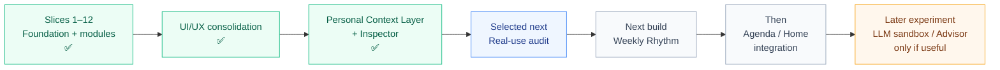

# Product Roadmap

This roadmap tracks delivered slices and the current product direction. Sequence matters more than fixed dates, and a structurally obvious feature should not outrank a workflow that is actually useful.

The project has now moved out of its module-building phase. The default question is no longer **“what new space should we add?”** but **“how can the information already in Personal Control Center work together?”** New standalone domains should require a clear recurring need.

The broad UI/UX consolidation work is complete enough to return to a usage-led approach: future interface changes should respond to concrete friction rather than modernisation for its own sake. The **Personal Context Layer and Context Inspector are now implemented** as the cross-space foundation.

The next product exploration is a short real-use audit followed by **Weekly Rhythm**: flexible weekly intentions and cadence-based planning that can add structure without forcing a rigid daily routine or streak system. Agenda/Home integration can then consume the same context. AI remains exploratory rather than a committed next slice.

## Progress at a glance


```mermaid
graph LR
    S1["Slices 1–12<br/>Foundation + modules<br/>✅"]
    UX["UI/UX consolidation<br/>✅"]
    CTX["Personal Context Layer<br/>+ Inspector<br/>✅"]
    AUDIT["Selected next<br/>Real-use audit"]
    RHY["Next build<br/>Weekly Rhythm"]
    INT["Then<br/>Agenda / Home<br/>integration"]
    LAB["Later experiment<br/>LLM sandbox / Advisor<br/>only if useful"]

    S1 --> UX --> CTX --> AUDIT --> RHY --> INT --> LAB

    classDef done fill:#ecfdf5,stroke:#10b981,color:#065f46;
    classDef selected fill:#eff6ff,stroke:#3b82f6,color:#1e3a8a;
    classDef experimental fill:#fff7ed,stroke:#f59e0b,color:#78350f;
    classDef planned fill:#f8fafc,stroke:#94a3b8,color:#334155;
    class S1,UX,CTX done;
    class AUDIT selected;
    class RHY,INT planned;
    class LAB experimental;
```

## Delivered foundation

### Slice 1 — Phone-first foundation

**Status: complete in PR #7.**

Delivered the initial shell, Capture, Inbox, Projects, Thoughts, Review, All Spaces, prototype persistence, early PWA support, and Docker-ready runtime.

### Slice 2 — Actionable projects

**Status: complete in PR #10, with later action refinements.**

Projects support action history, Waiting, overdue attention, completion notes, Accomplishments, Archive, multiple open actions, optional dates, optional Details, rescheduling history, and explicit project completion.

PR #62 also surfaces project actions due today on Home alongside Tasks.

### Slice 3 — Durable deployment

**Status: complete in PR #13, with later hardening.**

The application runs on a Raspberry Pi with PostgreSQL canonical state, invite-only isolated accounts, Tailscale Funnel, local backups, encrypted off-site R2/restic backups, restore tooling, and production validation.

### Slices 4–6 — Tasks, Weekly Review, Calendar, and offline Capture

**Status: complete.**

Delivered standalone Tasks, fixed Saturday-to-Friday Weekly Review, History, reminders, review photos, one-way Google Calendar projection for dated Tasks/project actions, and Capture-only offline recovery through the PWA/service worker.

### Workflow extensions — Projects and Notes

**Status: complete.**

Notes provide autosaving editable reference text, safe Markdown, compact cards, ordering, and separation from Thoughts. Projects support multiple open actions and lightweight action Details without becoming a subtask system.

### Slice 7 — Book Library

**Status: complete in PR #32, with later refinements.**

Books support ownership, reading state, Wishlist, Up next, private covers, dates, 0–10 ratings, reflections, ordering, and review context. The normal bookshelf remains owned-first rather than mixing Wishlist records into everyday browsing.

### Slice 8 — Interface simplification and themes

**Status: complete.**

The app uses compact phone-first navigation, configurable mobile pins, All Spaces, shared semantic styles, and optional game-inspired themes without changing workflow semantics.

### Slice 9 — Personal Expenses

**Status: complete.**

Expenses support fast manual entry, fixed 50/30/20 reference targets, rolling Fun Fund, editable history, and filtered Insights without imposing a weekly bank-reconciliation ritual.

### Slice 10 — Encrypted Password Keychain

**Status: complete in PRs #55, #56, and #58.**

The Keychain is a client-encrypted vault with its own security boundary, recovery flow, isolated tables/APIs, ciphertext-only backup/export behavior, and explicit browser-delivered-code limitations.

Keychain is permanently excluded from every AI/context path.

### Slice 11 — Food v1

**Status: complete in PR #60.**

Food shipped as a lightweight Recipe Book with recipes, ingredients, steps, notes, photos, tags, ratings, make-again state, and Copy ingredients. Meal planning, nutrition, freezer inventory, and other routine features remain deferred until real use justifies them.

### Slice 12 — Library: Books, Movies, and Series

**Status: complete in PR #64.**

Library is now one umbrella space with first-level **Books | Movies | Series** shelves rather than a separate top-level Media destination.

Movies support independent status/wishlist browsing, rating, thoughts, one optional Watched on date, and private posters.

Series support independent status/wishlist browsing, rating, thoughts, optional start/finish dates, private posters, and lightweight current season/episode resume position. Series opens on Watching by default.

Historical completeness is not required. New Media data can accumulate naturally instead of becoming a backfilling task.

See [`media-library.md`](media-library.md).

## UI/UX consolidation — delivered, now usage-led

**Status: broad refresh complete; no new generic redesign is selected.**

Navigation, Home/Today, density, visual hierarchy, and shared interface rules have already received the main consolidation pass recorded in [`ux-refresh-2026.md`](ux-refresh-2026.md).

Further UI work should now come from actual friction, screenshots, or a clearly better interaction pattern. Agenda remains a product/integration question rather than a page that should be cosmetically redesigned in isolation.

## Personal Context Layer — implemented

**Status: implemented as deterministic, read-only cross-space infrastructure.**

`src/domain/personal-context.ts` now composes bounded representations from explicitly selected domains:

- Projects;
- Tasks;
- Weekly Reviews;
- Thoughts;
- Notes;
- Library;
- Food;
- Expenses.

The layer uses canonical PCC state, preserves stable record IDs where useful, includes current/open state plus bounded recent history, truncates long text predictably, and requires explicit domain selection.

It does **not** provide a generic database query interface. Calendar and Markets are not context domains yet because there is no concrete consumer that needs them.

Keychain is structurally excluded: it is not part of the domain type, parser, builder, or context endpoint.

### Context Inspector — implemented

The authenticated **Context Inspector** at `/spaces/context` exposes the exact structured representation produced by the layer.

It shows:

- selected domains and purpose;
- the applied limits;
- the exact generated context;
- character count and an approximate token count.

This is a development/privacy-audit surface rather than a normal daily workflow. It allows the context boundary to be inspected before any LLM provider is introduced.

## Selected next — real-use audit and Weekly Rhythm

Before adding another broad module, review which PCC spaces are used frequently, occasionally, rarely, or not at all and why. That should reveal where existing workflows deserve refinement and where integration would create more value than new features.

The first planned consumer of the Context Layer is **Weekly Rhythm**.

The intended model is deliberately more flexible than a traditional habit tracker:

- fixed commitments remain hard constraints;
- dated Tasks and Project Actions remain normal actionable work;
- flexible weekly intentions can express goals such as “run 3 times” or “do focused work on 4 days” without choosing exact days in advance;
- optional preferences may describe useful patterns such as morning/evening or approximate session length;
- completion is counted across the week rather than treated as a streak or a missed daily obligation;
- the week should retain room for spontaneous choices.

This gives PCC enough structure to help build habits while preserving irregular weeks instead of inventing a routine the user does not actually follow.

After Weekly Rhythm proves its shape, Agenda/Home can consume the same context to present a useful near-term horizon without attempting to replace Google Calendar.

## AI direction — experiment, not committed product slice

See [`personal-advisor.md`](personal-advisor.md).

The earlier roadmap promoted a read-only Personal Advisor directly after Media. That is no longer the current commitment.

The stronger reason to explore AI is twofold:

1. test whether coherent PCC context enables genuinely better conversations or interactions than ordinary deterministic views;
2. use PCC as a practical environment for learning how API authentication, billing, model selection, reasoning effort, token usage, memory, tools, safety, and provider choice work in a real personalised system.

### Experimental LLM sandbox

With the Personal Context Layer in place, an internal LLM sandbox may be added later if the usage audit and deterministic integrations still leave a clear conversational need.

A useful experiment would expose:

- free-form and multi-turn conversation;
- selected context domains;
- model and reasoning/effort configuration;
- input/output token usage;
- approximate request cost;
- latency and errors;
- the exact context sent to the provider.

Calls should initially happen only when explicitly requested by the user. There is no reason to pay for periodic background inference just to make PCC appear intelligent.

### What is worth testing

The experiment should not be reduced to recommendation buttons.

Potentially meaningful uses include:

- discussing a book after finishing it;
- returning months later to compare a new reading experience with an older book and previous reflection;
- discussing a Weekly Review conclusion from another perspective;
- talking through a work/study/life decision while relevant Projects and recent reflections are available;
- asking a broad question without first manually reconstructing the relevant PCC context.

The model may bring broader public/general knowledge into the conversation while PCC contributes private structured context.

This is closer to the long-term idea of a conversational personal counterpart than a recommendation engine, but it must prove value through real use.

### Memory is a separate design problem

Do not implement long-term personalisation by replaying an unbounded transcript.

If memory is explored, separate:

- **canonical PCC state** — queried fresh from Projects, Tasks, Library, Reviews, Food, etc.;
- **short-term conversation state** — recent turns sent verbatim for follow-ups;
- **stable personal memory** — a compact PCC-owned store of durable preferences or conclusions;
- **episodic conversation memory** — summaries/retrieval of older relevant discussions.

A useful request should eventually be closer to:

```text
recent conversation
+ relevant older conversation summaries
+ compact stable memory
+ fresh relevant PCC context
```

rather than months of raw transcript.

Persistent memory, if implemented, needs explicit retention, editing, deletion, export, backup, and privacy rules.

### Model independence

Durable PCC context and memory should be owned by PCC rather than one model generation. A later model should be able to consume the same personal history even if the provider or model changes.

### Promotion gate

Do not promote the sandbox into a polished Advisor merely because the API works.

A permanent AI product should show repeated value beyond:

- what Home/Review/Library can already show deterministically;
- what a normal ChatGPT conversation can provide with manually supplied context;
- occasional one-off recommendations.

Good evidence would include repeated use where stored PCC history materially improves the conversation, meaningful continuity from memory, cross-domain reasoning that is inconvenient to assemble manually, or confirmed-action workflows that remove real friction.

If those signals do not appear, the experiment can remain internal, be removed, or evolve into a PCC-to-external-assistant connector.

### Read/write boundary

Initial experiments remain read-only with respect to canonical PCC data.

Future model-assisted writes may be useful, for example:

- rescheduling a Task/project action from natural language;
- saving a generated shopping list as a Note;
- adding a proposed item to a wishlist.

If explored, the model should propose a specific structured mutation, PCC should show it, and the user must explicitly confirm it through the normal deterministic mutation path.

Do not give an LLM unrestricted database-write access or allow ordinary conversation to silently create Thoughts, Notes, Tasks, or other records.

### Proactivity

A future Jarvis-like direction may include proactive observations, but deterministic software should detect simple facts first.

For example, PCC can identify overdue actions, repeated reschedules, unfinished Reviews, or projects with no open actions without spending model tokens. AI should be invoked only if interpretation adds value.

Proactivity must prove that it is helpful rather than noisy before becoming recurring behavior.

### External-assistant option

PCC may eventually expose the same carefully scoped context/tools to an external conversational product such as ChatGPT through an appropriate connector/tool protocol.

That route may be preferable if ChatGPT remains a better conversational environment while PCC remains the canonical personal-data source.

The architecture should therefore avoid tying the Personal Context Layer specifically to one PCC chat page.

## Integration principle — shared context before hard coupling

Do not create database relationships merely because two spaces could theoretically be connected.

Examples:

- Food can expose saved recipes, ratings, make-again state, and cooking notes without directly owning supermarket transactions.
- Expenses can expose bounded spending context without linking every purchase to another domain.
- Library can expose ratings, reflections, Wishlist/current state, and sparse history without becoming an AI recommendation engine itself.
- Projects, Tasks, dates, and Weekly Review can contribute to a common workload view without changing canonical ownership.
- Thoughts can be context without silently becoming obligations.

Shared context should make later integrations possible without forcing them.

## Later exploration — Weekly Rhythm and connected planning

**Status: concept retained; requires product design before implementation.**

Weekly Rhythm may eventually describe the expected shape of a week without becoming a generic habit tracker or hour-by-hour calendar.

Potential inputs include:

- dated Tasks and project actions;
- Calendar events;
- recent Weekly Review context;
- recurring work/study/training commitments;
- preferred working locations/day types;
- later Food/meal-prep expectations;
- exceptions for unusually busy, free, travel, or recovery days.

Its value must come from reducing planning friction rather than duplicating Calendar or Tasks.

## Targeted cross-space integrations

Direct cross-space behavior should be added only when a real workflow benefits from it.

Possible later examples:

- Food → planned meal/prep context → Weekly Rhythm;
- Library → current reading/watching context → conversation or planning;
- Tasks/project actions → Home, Calendar, Weekly Rhythm, or confirmed natural-language control;
- Weekly Review → context for later reflection or pattern discussions;
- Thoughts → context or explicit user-approved conversion suggestions;
- Expenses → bounded financial context while otherwise remaining largely standalone.

These are examples, not commitments.

## Other future candidates and follow-ups

### Today/Home horizon

A focused near-term view for genuinely dated work may still be useful, likely from Home rather than All Spaces. It should not pressure uncertain work to acquire invented dates.

### Food follow-ups

Use the Recipe Book first. Revisit prepared portions/freezer inventory, weekly meal expectations, Prep Sunday, nutrition, or grocery workflows only after real meal-prep usage shows which information is worth maintaining.

### Routines/Habits

Consider recurring responsibilities as possible Weekly Rhythm inputs before automatically creating another standalone space. Avoid generic streak mechanics without a real planning need.

### Events/Appointments

A future time-specific commitment model could justify start/end times, locations, preparation context, and perhaps a clearer reason to revisit inbound Calendar synchronization.

### Trips

Prefer integration with existing dates, Tasks, Expenses, and context before building a large travel-management module.

### Fitness

Prefer imported activity/trend summaries over a manual workout logger. Recurring training structure may be useful before a dedicated space is justified.

### Library follow-ups

Photo-assisted book identification remains tracked in issue #33. Metadata lookup, richer progress, highlights, streaming availability, and automatic catalog imports should wait for observed need.

### Weekly Review Web Push

The real-device observation in issue #21 confirmed that browser-side scheduling alone does not deliver while the PWA is closed. Issue #74 implements the deliberately narrow follow-up: one server-driven reminder each local morning from Saturday through Friday while the current Weekly Review remains unsubmitted.

This does not open a generic notifications roadmap. Broader task/project notifications remain out of scope unless real usage creates a specific need.

### Calendar role

Issue #72 now owns the Agenda/Google Calendar product decision, including whether a dedicated Agenda survives, becomes Upcoming, or yields to selective Calendar context on Home/Today. The older optional two-way-sync issue #26 was closed as superseded.

## Product rules that continue to constrain future work

- Phone usability comes before desktop decoration.
- PCC remains useful without integrations, notifications, or AI.
- External services do not silently become canonical.
- Offline claims remain narrower than the actual supported workflow.
- New modules should solve observed recurring needs.
- Shared context should come before hard coupling.
- Domain-specific context providers are preferred over generic database access.
- Missing/sparse personal history must not be treated as negative evidence.
- AI is exploratory and advisory until proven otherwise.
- No polished Advisor is currently committed.
- Model calls should not be spent on facts deterministic code can compute.
- Any future model-assisted mutation must be explicit and user-confirmed.
- Keychain secrets are never part of AI/context paths.
- Features should be selected from observed friction or value, not because they are common in planning apps.

The current selected next step is therefore simple: **make the existing product easier to navigate and scan first; then make its information coherently accessible for cross-space context before deciding what intelligence, if any, should sit on top of it.**